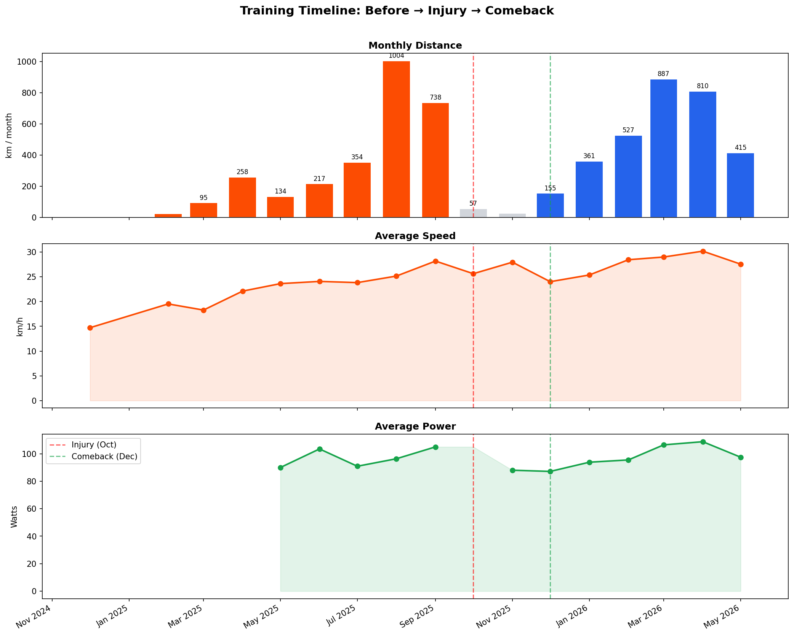
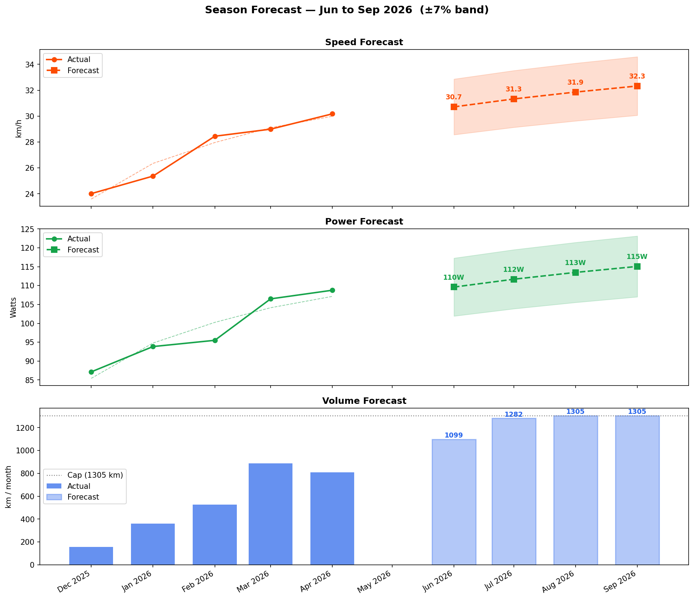

# 🚴 Strava Cycling Analysis

Personal cycling data analysis built on a Strava activities export.
**Dec 2024 – May 2026** · 175 rides · 123 virtual (Zwift) + 52 outdoor.

---

## My story

I started cycling seriously in late 2024 with no real baseline — first FTP test in June 2025 came in at **140W**. Over the following three months I trained consistently on Zwift and managed to push that up to **165W** by late September. Things were going well.

Then in **October 2025 I broke my hand** and couldn't ride for almost two months. No trainer, no Zwift, nothing. Coming back in December felt like starting over — short easy rides, low watts, frustrating gaps between where I was and where I wanted to be.

But the comeback was faster than expected. By April 2026 I hit **170W on a ramp test** — already above my pre-injury peak. Average speed went from 28.2 km/h to 30.2 km/h. Monthly volume climbed back past 800 km.

The injury turned out to be a detour, not a setback.

---

## Goals

- 🎯 **Break 200W FTP** — the big one. Currently at 170W, need +30W. Realistic target: **early 2027** with consistent training.
- ⚡ **Improve outdoor speed** — virtual riding builds fitness but real roads are the real test. Target: consistently above 30 km/h on outdoor rides by end of season.

---

## Season forecast



*Orange = before injury · Gray = injury gap · Blue = comeback*



*Projections based on Dec 2025 – Apr 2026 comeback trajectory. Speed & power use a log curve (diminishing returns). Volume capped at 130% of pre-injury peak.*

| Month | Speed | Power | Volume |
|---|---|---|---|
| Jun 2026 | 30.7 km/h | 110W | ~1,100 km |
| Jul 2026 | 31.3 km/h | 112W | ~1,280 km |
| Aug 2026 | 31.9 km/h | 113W | ~1,305 km |
| Sep 2026 | 32.3 km/h | 115W | ~1,305 km |

---

## Key findings

- **175 cycling rides** — 123 virtual on Zwift, 52 outdoor
- **~5,700 km total** across 17 months
- **Best month:** 1,004 km in August 2025 (pre-injury peak)
- **FTP progression:** 140W → 165W → *(2 months off)* → 170W
- **Already above pre-injury levels** in both speed and power after comeback
- **200W FTP target:** Nov 2026 (optimistic) · Mar 2027 (realistic) · Sep 2027 (conservative)

---

## Notebook contents

`strava_analysis.ipynb` — 13 sections:

| # | Section | What you'll find |
|---|---|---|
| 1 | Data loading & cleaning | Parses the Strava CSV, converts units |
| 2 | Activity overview | Summary stats, rides by day of week |
| 3 | Distance & volume trends | Monthly km/hours, cumulative distance |
| 4 | Speed analysis | Distribution, rolling trend, virtual vs outdoor |
| 5 | Heart rate zones | Z1–Z5 breakdown, HR over time |
| 6 | Power analysis | Watt distribution, trend, power vs HR efficiency |
| 7 | Cadence analysis | Distribution vs 90 rpm target, trend over time |
| 8 | Elevation & effort | Climbing rate, relative effort, correlation heatmap |
| 9 | Virtual vs outdoor | Side-by-side comparison across 8 metrics |
| 10 | Personal records | All-time bests + top 10 longest rides |
| 11 | Comeback story | Timeline showing the injury gap and recovery |
| 12 | Season forecast | Speed, power & volume projection Jun–Sep 2026 |
| 13 | FTP progression | Real ramp test results + 200W target forecast |

---

## Setup

```bash
# Clone and enter project
git clone <repo-url>
cd strava-cycling-analysis

# Create virtual environment
python3 -m venv .venv
source .venv/bin/activate          # Windows: .venv\Scripts\activate

# Install dependencies
pip install pandas matplotlib seaborn numpy jupyter plotly ipykernel

# Register kernel (for VS Code / JupyterLab)
python3 -m ipykernel install --user --name strava-venv --display-name "Python 3.12 (.venv)"

# Open notebook
jupyter lab strava_analysis.ipynb
```

**Using your own Strava data:**
Go to **Settings → My Account → Download or Delete Your Account → Request Your Archive**.
Unzip and place `activities.csv` in the project root, then run all cells.

---

## Live API integration

This project now connects directly to the Strava API —
no more manual CSV exports.

### Setup

1. Create a Strava API app at https://www.strava.com/settings/api
   (set the **Authorization Callback Domain** to `localhost`)
2. Copy `.env.example` to `.env` and add your client ID + secret
3. Run `python auth.py` to complete OAuth (opens browser)
4. Your token is stored locally in `strava_tokens.json` and refreshes automatically

### Upload a workout

```bash
python upload.py --type ride --distance 45.2 --time "1:30:00" --name "Evening loop"
```

Manual indoor session:

```bash
python upload.py --type gym --time 3600 --name "Strength" --trainer
```

### Sync recent activities

```bash
python sync.py            # pulls everything new since the last sync
python sync.py --days 30  # or a fixed window
python sync.py --dry-run  # preview without writing
```

New rides are normalized into the same columns the notebook uses and
appended to `activities.csv`, deduped by Activity ID — just re-run the
notebook afterwards.

### Upload a GPX/TCX/FIT file

```bash
python upload.py --file morning_ride.gpx
```

### Files

| File | Purpose |
|---|---|
| `strava_client.py` | OAuth2 flow, token refresh, rate-limited API wrapper |
| `auth.py` | One-time browser OAuth setup |
| `upload.py` | CLI: manual activity entry or GPX/TCX/FIT upload |
| `sync.py` | Pulls new activities and merges them into `activities.csv` |

> **Rate limits:** the client reads Strava's rate-limit headers and
> automatically pauses near the 100-requests / 15-minutes (1,000 / day) caps.

---

## Stack

Python 3.12 · pandas · matplotlib · seaborn · numpy · Jupyter · requests (Strava API)
